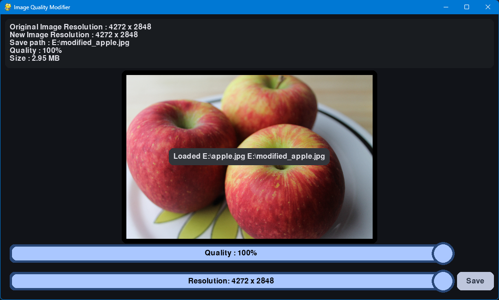

# Image Quality Modifier

The **Image Quality Modifier** app is a simple, efficient tool designed for adjusting JPEG image resolution and compression quality. This application provides a fast and convenient way to resize images without relying on complex software or online tools, making it especially helpful for tasks like mass online registrations where images must meet specific size requirements.

## Features

- **Drag-and-Drop Loading**: Easily load images by dragging them onto the app interface.
- **Real-Time Preview**: Use a slider to change image resolution and see the effects in the live preview.
- **Zoom and Pan**: Use the scroll wheel to zoom and right-click + drag to pan across the image.
- **Automatic Save Location**: Saved images are stored in the same folder with a "modified_" filename prefix.




## System Requirements

- **Python** 3.12.0 or above
- **Pygame** 2.5.2
- **Pillow** 11.0.0


## Installation

1. Clone the repository from GitHub using Git:

   ```bash
   git clone https://github.com/divyansh0x0/csproject_2024_25.git
   ```
   Or download the source code as ZIP file

   

   Or download it from the release section


3. Install Pygame and Pillow using `pip`:

   ```bash
   pip install pygame==2.5.2
   pip install pillow==11.0.0
   ```

## Usage

1. Open a terminal and navigate to the `csproject_2024_25` directory.
2. Run the app by typing:

   ```bash
   python app.py
   ```

3. Load an image by dragging and dropping it onto the window.
4. Adjust image quality with the slider.
5. Save the modified image by clicking the save button.

## Contribution
This Image Quality Modifier app is a Computer Science project developed by Class XII students Divyansh, Arman, and Hashmita for the 2024-25 academic year.
